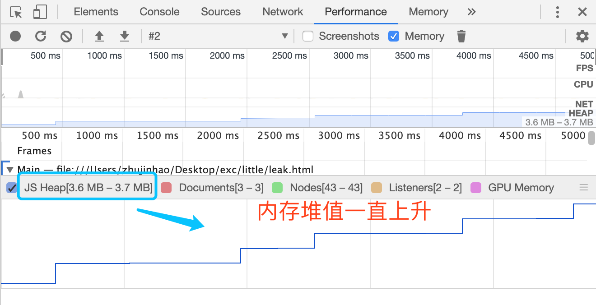
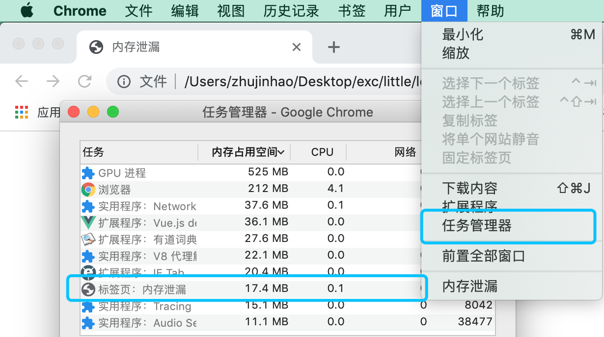
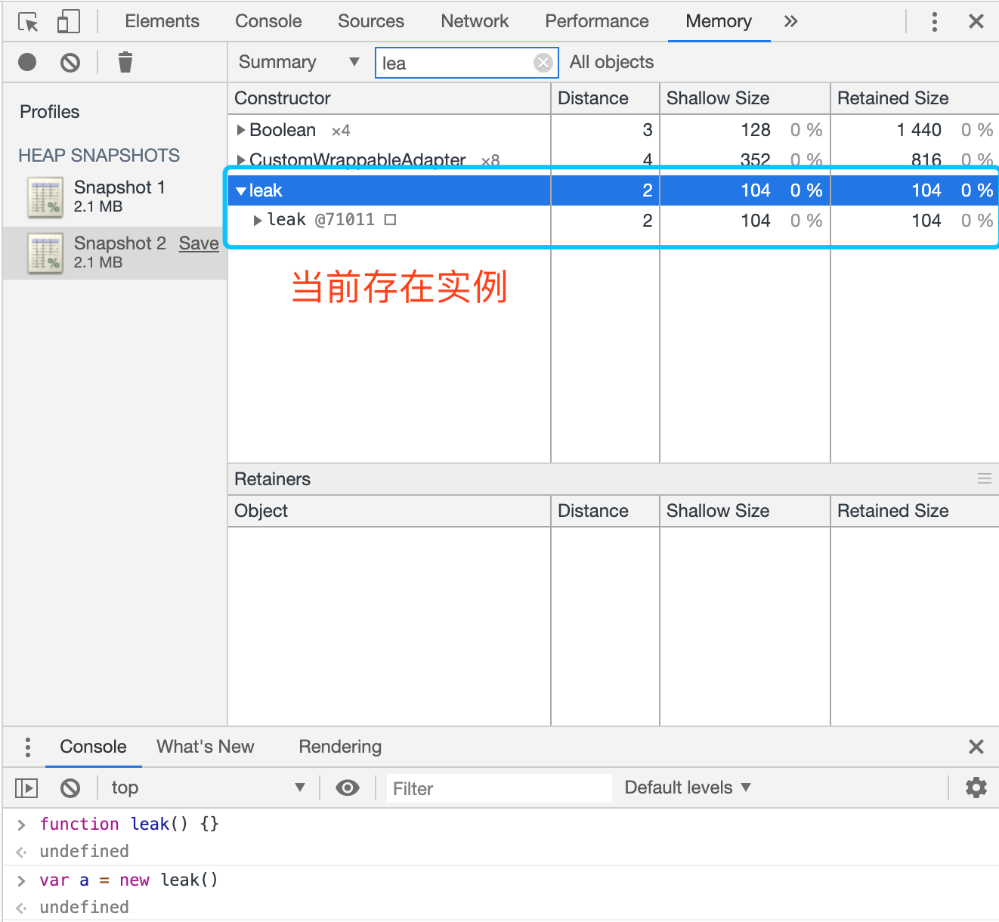

# 内存
内存是JS存储数据最常用的方式。   
内存的生命周期分为三个阶段，创建 > 使用 > 回收。

## 内存创建
内存会存储在二块地方，栈 stack 和 堆 heap。   

通过例子，演示JS如何创建内存。

```
const name = 'i am iron man'; //存储在内存栈(stack)

const avengers = ['iron man', 'captain america', 'thor']; //存储在内存推(heap)
```
其实很简单，就是直接给变量、常量或者对象的属性赋值。    
JS内存的分配策略是，值是基本类型存储在栈，引用类型存储在堆。


由上面图可以得出，stack是以像key-value键值对形式保存数据，    
当值是引用类型时，会存储在heap，stack会保存heap的引用地址。

## 内存回收
上面描述内存是如何创建的，接下来就介绍内存是如何收回销毁。    
其实内存回收的逻辑很简单，就是把“不再使用”内存找出来，然后销毁。   
可是大多数内存管理的问题都出现在这个阶段。	  

> 虽然浏览器会自动回收不再使用的内存，不需要开发者关心相关问题，但是即使是现在最新内存回收算法，也无法应对极端的情况。   
> 所以，开发者需要了解回收算法，在面临问题时作出合理方案。

### 标记清除算法

标记清除算法将“不再使用的对象”定义为“无法达到的对象”。 简单来说，就是从根部（在JS中就是全局对象）出发定时扫描内存中的对象。 凡是能从根部到达的对象，都是还需要使用的。 那些无法由根部出发触及到的对象被标记为不再使用，稍后进行回收。


```
const human = {
	name: 'tom',
	ill: {
		name: 'have a cold'
	}
} // 创建两个对象，human与ill

human.ill = null;
// 执行标记回收，{name: 'have a cold'}即human.ill的值，无法达到根本，被销毁
```

### 内存泄漏
内存泄漏的意思是，不再使用的内存没有被回收。   
内存泄漏会影响页面性能，造成卡顿，发热甚至闪退。   

上面提及到一句话，‘即使是现在最新内存回收算法，也无法应对极端的情况。’       
而极端的情况就会造成内存泄漏，现在我们通过例子，发掘极端情况有那些。

#### 意外的全局变量创建

```
function leak() {
    bar1 = 'some text'; // 没有声明变量 实际上是全局变量 => window.bar1
    this.bar2 = 'some text' // 全局变量 => window.bar2
}
leak();
```

#### 定时器未回收

```
var num = 0;
setInterval(function() {
	if(num === 5) {
		document.body.style.display = 'block';
		return;
	}
	
	num++;
}, 1000)
```

#### 没有及时删除dom引用

```
let imgEl = document.createElement('img');
document.body.appendChild(imgEl);

//do something

document.body.removeChild(imgEl); //img Dom移除后，imgEl对它引用没有移除。
```

### 内存泄漏排查
虽然浏览器不能在所有情况下智能回收内存，但为开发者提供各种调试工具，帮助其判断内存是否泄漏。

#### 使用performance录制
我们可以打开开发者工具，选择performance的tab页，然后录制7s，观察JS Heap值是否一直上升，如果是，这说明内存一直创建，没有被回收。



#### 打开任务管理器
我们也可以通过任务管理器查看页面使用内存情况。



#### 使用内存快照
打开开发者工具，选择memory的tab页，点击录制，可以查看页面未清除的所有实例，如果实例没有按预想清除，则说明内存泄漏。



## 参考资料
<a href="https://developers.google.com/web/tools/chrome-devtools/memory-problems/memory-101">内存术语 - google</a>   
<a href="https://juejin.im/post/5d0706a6f265da1bc23f77a9">JS中的内存管理</a>
