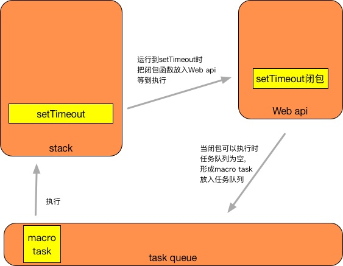
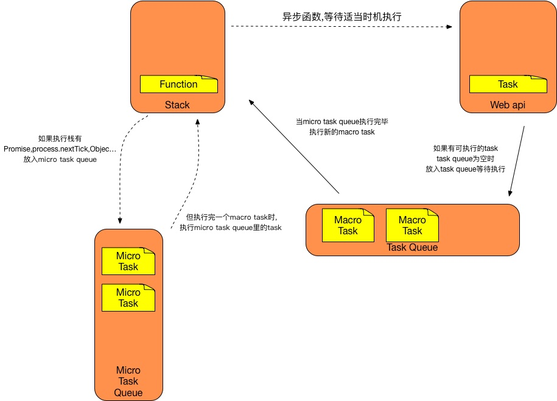
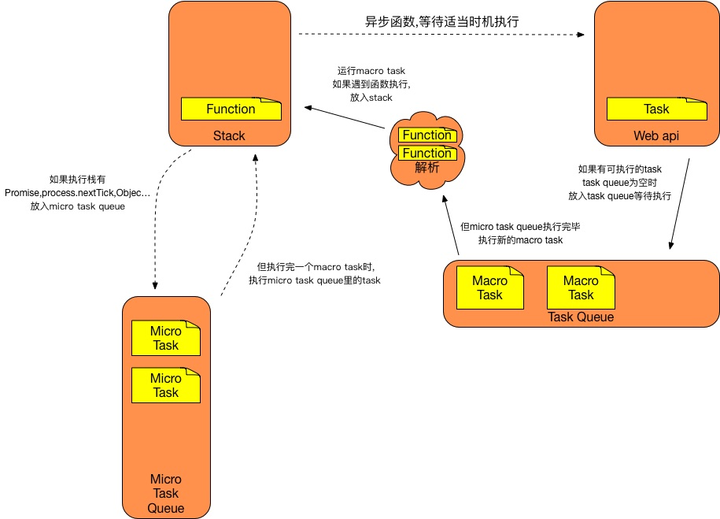

# 事件循环
## 了解知识点

* 线程
* 执行栈
* task queue
* web api
* macro task
* micro task

## 线程
javascript是**单线程**的语言,    
可以单线程将理解为只有一条车道,在车道里后面的车在等前面的车通过后,才能通过.    
即当前面的程序没有执行,后面的程序也不能执行.   

## 执行栈
**执行栈**像"车道",被执行的程序会放入执行栈里,    
但它的执行的顺序是,后面进来的程序先执行.

### 示例
<video src="../resource/stack.mp4" style="width: 600px; margin: 0 auto;" autoplay></video>

## task queue
在线程中有很多等待运行的任务(程序,而执行栈只会放入一个任务.    
其他可运行任务会放入**任务队列**中.    
这里虽说是个队列, 它的执行的顺序,不会先进的程序先执行.   
每个event loop都会有一个或多个**任务队列**

## web api
javascript是**单线程**,但也能实现异步,这种实现基与**页面提供很多API**,如(setTimeout, ajax, addEventListener ...)    
这些都是异步函数,也就是说,运行到异步函数时,    
把异步函数里闭包放入**web api**里,等待正确的时机,     
**web api**会把闭包放入**task queue**里执行.

### 示例


## macro task
**macro task**有setTimeout ，setInterval， setImmediate，requestAnimationFrame,I/O ，UI渲染...   
**task queue** 是由很多个**macro task**组成的队列,   

## micro task
**micro task**有Promise， process.nextTick， Object.observe， MutationObserver...   
每个event loop都会有一个**micro task**

## event loop
***执行流程***
***

1. 当执行栈为null时
2. 看task queue的第一个macro task是不是null,如果不是取出放入执行栈,如果是跳转5
3. 执行栈运行task
4. 运行完毕,把task设置null,并移出
5. 执行 micro task队列   
   a. 看micro task队列第一task个是不是null,如果不是取出放入执行栈,如果是跳转f   
   b. 执行栈运行task   
   c. 运行完毕,把task设置null,并移出    
   d. 看micro task队列下一个task是不是null,如果不是跳转b   
   f. 结束micro task队列执行
6. 跳转到1

### 示例


## 实战

```
<script>// 创建macro task, 因为stack 为null, 执行
(function test() {
  setTimeout(() => { // 创建macro task, 当前task queue['第一setTimeout闭包']
    console.log(4)
  }, 0);
  new Promise(resolve => {
    console.log(1); // 执行, 控制台 1
    for(var i = 0; i < 10000; i++) {
      i == 9999 && resolve(); // 创建micro task, 当前micro task queue['第一then闭包']
    }
    console.log(2); // 执行, 控制台 1 2
  }).then(() => {
    console.log(5);
    return new Promise(resolve => {
    	resolve()
    })
  }).then(() => {
  	console.log(6)
  });
  console.log(3); /* 执行, 控制台 1 2 3, 第一个script标签创建的macro task结束
                     运行micro task queue首个micro task === 第一then闭包
  	                 执行, 控制台 1 2 3 5, 
                     并创建了micro task 放入 micro task queue['第二then 闭包']
                     运行micro task queue首个micro task === 第二then 闭包
                     执行, 控制台 1 2 3 5 6
                  */
})()
</script>

<script>// 创建macro task, 因为stack 为null, 执行
(function test2() {
  setTimeout(function () { // 创建一个macro task 放入 task queue['第一setTimeout闭包' '第二setTimeout闭包']
    console.log(42)
  }, 0);
  new Promise(function executor (resolve) {
    console.log(12); // 执行 控制台1 2 3 5 6 12
    for(var i = 0; i < 10000; i++) {
      i == 9999 && resolve(); // 创建micro task, 当前micro task queue['第一then闭包']
    }
    console.log(22); // 执行 控制台1 2 3 5 6 12 22
  }).then(function() {
    console.log(52);
  });
  console.log(32); /* 执行, 控制台 1 2 3 5 6 12 22 32, 第二个script标签创建的macro task结束
                     运行micro task queue首个micro task === 第一then闭包
  	                 执行, 控制台 1 2 3 5 6 12 22 32 52, 
                     查看micro task queue首个task为null, 查看task queue
                     task queue为空,向web 获取可执行的任务['第一setTimeout闭包', '第二setTimeout闭包']
                     运行task queue首个 macro task === 第一setTimeout闭包
                     执行, 控制台 1 2 3 5 6 12 22 32 52 4   
                     查看micro task queue首个task为null, 查看task queue
                     运行task queue首个 macro task === 第二setTimeout闭包
                     执行, 控制台 1 2 3 5 6 12 22 32 52 4 42
                  */
})()
</script>
```

## 猜想
在**macro/micro task** 进入**执行栈**时,中间应该会有一个缓存区,   
例如

```
<script> // 创建macro task,进入执行栈
var a = () => {
	console.log('a');
}

var b = () => {
	console.log('b'); 
}

a(); //这时函数A进入stack,执行,打印出a
b(); //这时函数B进入stack,执行,打印出b
</script>
```

如果是把整个**macro task**放入**执行栈**,     
按后进程序先执行的机制, 应该会先打印'b',    
但打印的是'a',说明函数b是等函数a执行完后再进入执行栈的,   
所以在**macro task** 会把里面的函数拆分为一个执行的队列,放入**执行栈**里.

### 示例


## 参考资料
[https://github.com/ccforward/cc/issues/48](https://github.com/ccforward/cc/issues/48)   
[https://juejin.im/entry/596d78ee6fb9a06bb752475c](https://juejin.im/entry/596d78ee6fb9a06bb752475c)